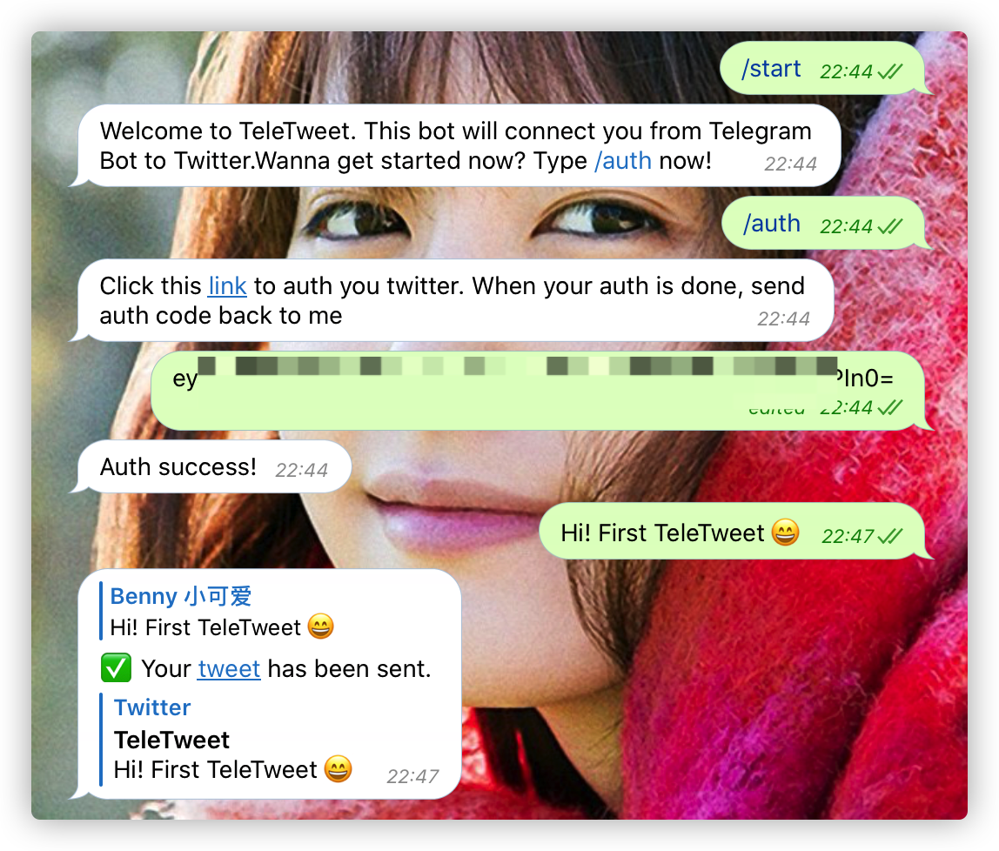
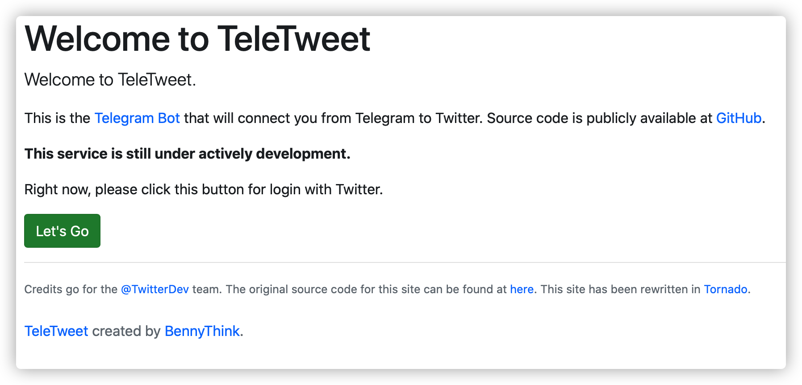
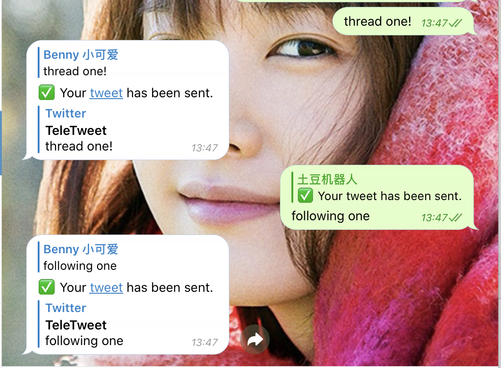
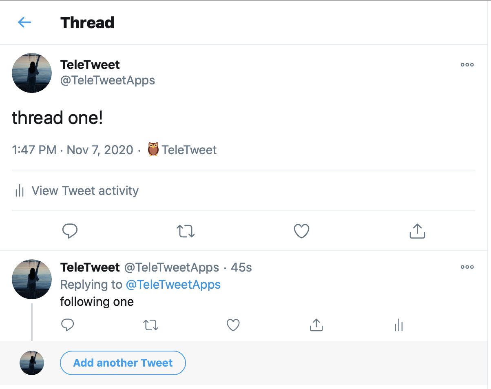
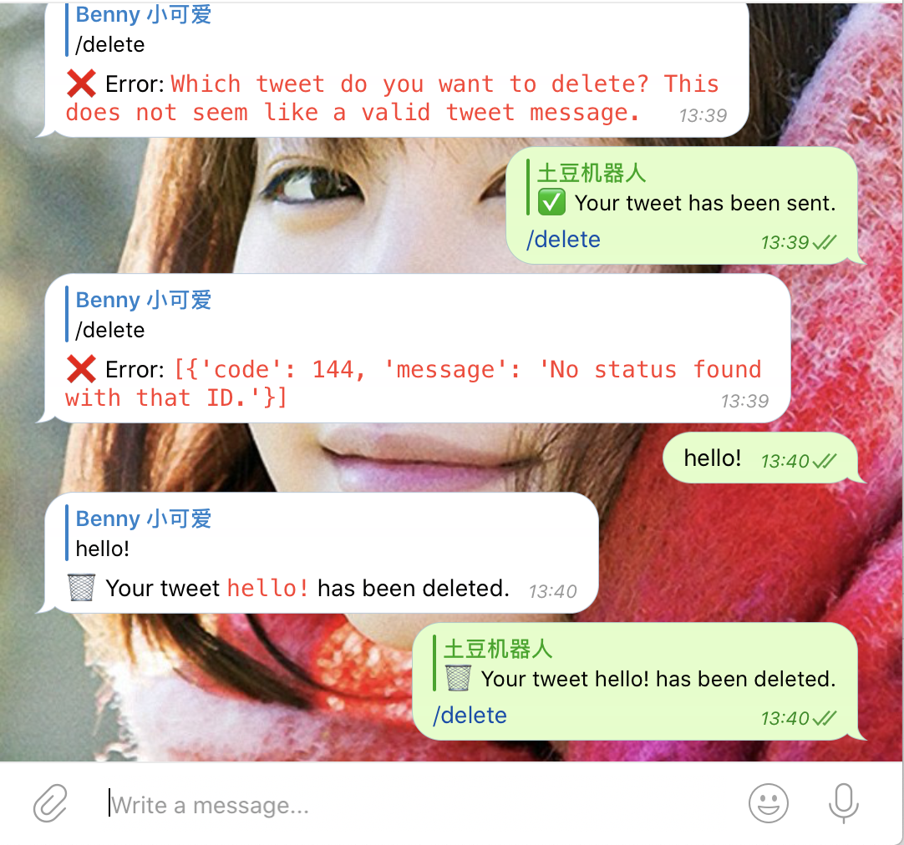
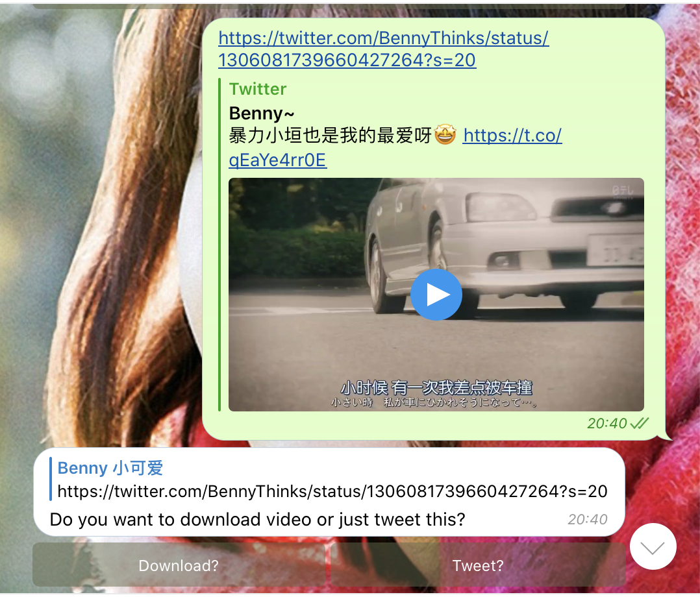
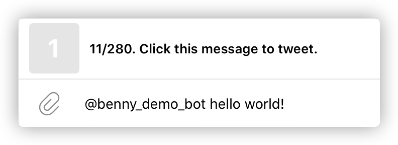
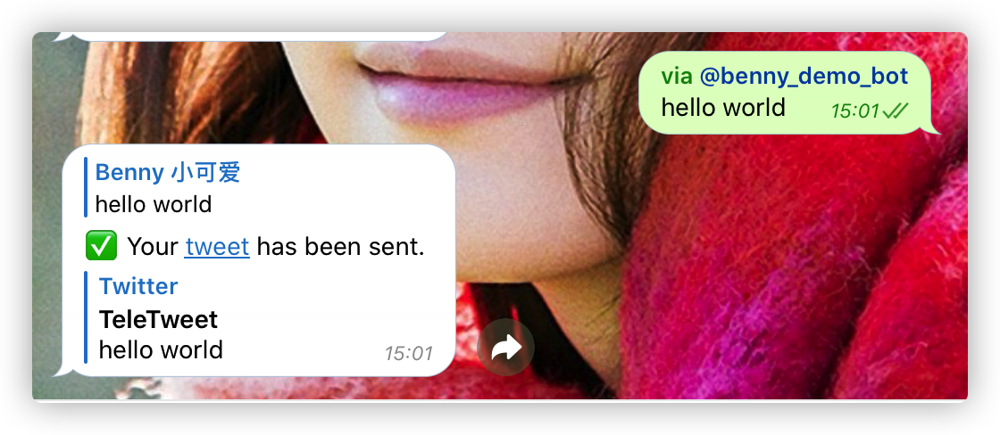
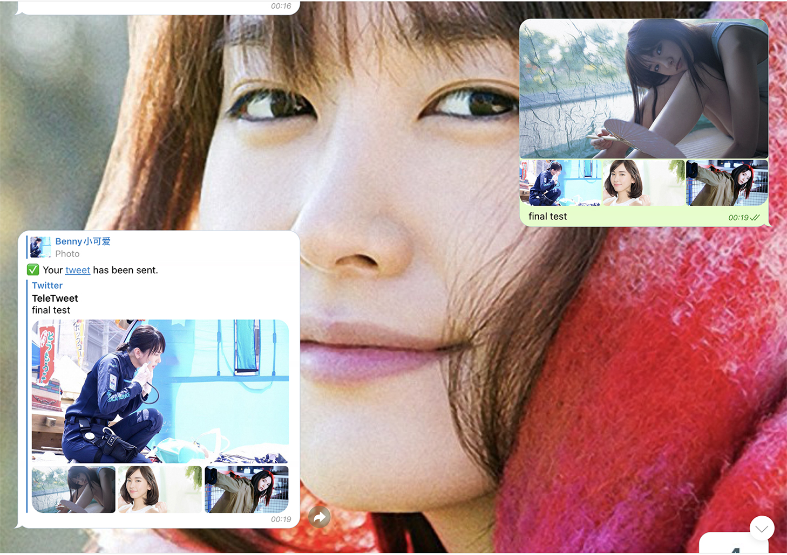
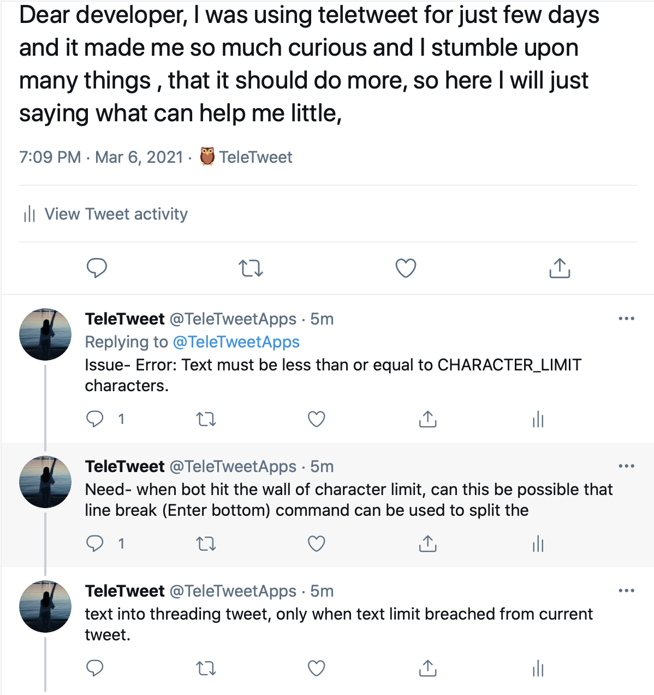

# TwitterBot
🦉 A telegram Twitter bot that will allow you to send tweets!

[TeleTweet](https://t.me/tele_tweetbot)

# Features
All the following features rely on authorized users.
* send text tweet
* send tweet with one photo(photo and document are supported.)
* reply bot tweet message to add more tweets to this thread
* reply `/delete` to delete tweet
* send any video tweet to download the video
* inline character calculation
* send pictures as a group, it will result in multiple photos in your tweet(max photo restrictions is 4)

# Commands
```
start - Start using it today
sign_in - Go to sign in with Twitter
sign_off - sign off from Twitter
help - What is this bot
ping - Status about this bot
delete - Delete tweet
```

# Usage
## Screenshots
The most simple way to tweet!


## Sign in

Chat with [this bot](https://t.me/tele_tweetbot), and go to oauth by its instruction:


Copy and paste the auth code to this bot. And you're good to go!
## Tweet
### New thread tweet
Send any text message, photo/photo as file with caption will send tweet with photos.


### Reply to this thread
Reply to bot's tweet message,



and you'll consult in a series of thread.


## Delete tweet
Reply command `/delete` to bot's message and it will delete this tweet for you.



## Download tweet video
You could just send any video tweet, such as this one 

https://twitter.com/BennyThinks/status/1306081739660427264?s=20

The bot will first determine if this is a video tweet, if the answer is yes, 
it will ask what do you want to do with it:



Depending on your choice, this bot will download this video or retweet.


## Inline mode
Use `@tele_tweetbot` within TeleTweet bot chat to see character limit in case you exceed it.

Once you have compose your tweet, hit the message to send you tweet.





**Be aware: using inline mode in another chat won't send tweet for you.** 

## multiple photo mode
**Group feature requires a newer version of Telegram**
Just send a group of photos, add some captions if you want to, and hit send.


**Warning: if you send more than four photos in a group, this bot will only send first four photos in a tweet**

## threaded-tweets
Twitter has max character limit of 280. If you want to send tweet more than this limit, you need to manually add new lines.

For example, one or more blank line is acceptable.
```
Dear developer, I was using teletweet for just few days and it made me so much curious and I stumble upon many things , that it should do more, so here I will just saying what can help me little,

Issue- Error: Text must be less than or equal to CHARACTER_LIMIT characters.

Need- when bot hit the wall of character limit, can this be possible that line break (Enter bottom) command can be used to split the
text into threading tweet, only when text limit breached from current tweet.
```
And the result would be


# General deployment
This bot use oauth, so you need to apply an app, setup callback url.
More info could be seen [here](https://github.com/twitterdev/twauth-web).

## Bot
```shell script
git clone https://github.com/tgbot-collection/TeleTweet/
cd TeleTweet
pip3 install -r requirements.txt
export TOKEN="BOT_TOKEN" \
 CONSUMER_KEY="key"  CONSUMER_SECRET="secret" \
touch teletweet/database.enc
python3 teletweet/bot.py
```
## Web server
```shell script
vim twauth.py
# change this three lines to your own
APP_CONSUMER_KEY = os.environ.get("CONSUMER_KEY") or '1'
APP_CONSUMER_SECRET = os.environ.get("CONSUMER_SECRET") or '2'
callback_url = os.environ.get("CALLBACK_URL") or "http://127.0.0.1:8888/callback"

# run it
python3 twauth.py
```

# Docker
You can run/develop using docker.
```shell script
docker run -d --restart=always -e TOKEN="BOT_TOKEN" \
-e CONSUMER_KEY="key" -e CONSUMER_SECRET="secret" \
-v `pwd`/database.enc:/TeleTweet/teletweet/database.enc \
bennythink/teletweet

docker run -d --restart=always -e TOKEN="BOT_TOKEN" \
-e CONSUMER_KEY="key" -e CONSUMER_SECRET="secret"  \
bennythink/teletweet python3 /TeleTweet/twauth-web/twuath.py
```

# Plans
- [x] support multi-user, based on oauth, encrypted with AES-128-CBC
- [x] help
- [x] about
- [x] start
- [x] multi photo
- [ ] timeline
- [ ] new
- [ ] like


# Warning
## 1. Early development 
This bot is still under **early development process**. Anything may subject to change.
## 2. Data security
You need to use oauth to use this bot, and this bot will **save your oauth token** in its file system.
Under this circumstance, it means: 1). The bot will have access to your Twitter data 
2). the oauth token has been encrypted by AES-128-CBC. 
However, due to technical limitation, the encryption key is **available from host machine**, 
but I promise I won't do anything with your twitter account.
## 3. oauth token
The token was saved with **AES-128-CBC**, and the key is **available from the host machine**.
This means anyone have access to host machine could acquire key and decrypt the token.

Anyway, I promise I won't touch your token and Twitter account 
and I'll **do everything I can** to secure my host machine.

It's just like you're using a third party Twitter App, you trust it so you choose to use it. It's just like that.

Nevertheless, you could try to deploy your own bot - it's an open source project, you know.


# Credits
* [twauth-web](https://github.com/twitterdev/twauth-web)

# FAQ
## Connection reset by peer - twauth-web
If you ran into this problem when using twauth-web, probably you need to upgrade your Python.
Try to pyenv and install a latest version of Python, and this will be likely be fixed.

# License
GPL 2.0