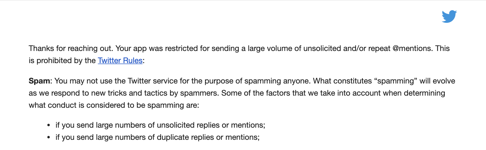

# TwitterBot
🦉 A telegram Twitter bot that will allow you to send tweets!



# Features
All the following features rely on authorized users.
* send text tweet
* send tweet with one photo(photo and document are supported.)
* reply bot tweet message to add more tweets to this thread
* reply `/delete` to delete tweet
* send any video tweet to download the video
* send pictures as media group, it will result in multiple photos in your tweet(max photo restrictions is 4)

# Commands
```
start - Start using it today
sign_in - Go to sign in with Twitter
sign_off - sign off from Twitter
help - What is this bot
ping - Status about this bot
delete - Delete tweet
```

# Usage
## Screenshots
The most simple way to tweet!


## Sign in

Chat with [this bot](https://t.me/tele_tweetbot), and go to oauth by its instruction:


Copy and paste the auth code to this bot. And you're good to go!
## Tweet
### New thread tweet
Send any text message, photo/photo as file with caption will send tweet with photos.


### Reply to this thread
Reply to bot's tweet message,


and you'll consult in a series of thread.


## Delete tweet
Reply command `/delete` to bot's message and it will delete this tweet for you.


## Download tweet video
You could just send any video tweet, such as this one 

https://twitter.com/BennyThinks/status/1306081739660427264?s=20

The bot will first determine if this is a video tweet, if the answer is yes, 
it will ask what do you want to do with it:


Depending on your choice, this bot will download this video or retweet.


## multiple photo mode
**Group feature requires a newer version of Telegram**
Just send a group of photos, add some captions if you want to, and hit send.


**Warning: if you send more than four photos in a group, this bot will only send first four photos in a tweet**


# General deployment
This bot use oauth, so you need to apply an app, setup callback url.
More info could be seen [here](https://github.com/twitterdev/twauth-web).

## Bot
```shell script
git clone https://github.com/tgbot-collection/TeleTweet/
cd TeleTweet
pip3 install -r requirements.txt
vim teletweet/config.py
# setup bot token, consumer key, consumer secret, app id, app secret(https://core.telegram.org/)
python3 teletweet/bot.py
```
If you want the bot to be only available to you, please setup `ALLOW_USER`, supplied with your own Telegram User ID.
Use `,` to separate.

## Web server
```shell script
vim twauth.py
# change this three lines to your own
APP_CONSUMER_KEY = os.environ.get("CONSUMER_KEY") or '1'
APP_CONSUMER_SECRET = os.environ.get("CONSUMER_SECRET") or '2'
callback_url = os.environ.get("CALLBACK_URL") or "http://127.0.0.1:8888/callback"

# run it
python3 twauth.py
```

# Docker
You can run/develop using docker. You can refer to `docker-compose.yml`
```shell
echo "{}"> env/auth.json
vim env/teletweet.env
# set up below config
BOT_TOKEN = os.getenv("TOKEN", "fghjk789")
APP_ID = os.getenv("APP_ID", "456fgh78")
APP_HASH = os.getenv("APP_HASH", "456gfhj78")

CONSUMER_KEY = os.getenv("CONSUMER_KEY", "456fghj78")
CONSUMER_SECRET = os.getenv("CONSUMER_SECRET", "45678fghj")

docker-compose up -d

```

# Plans
- [x] support multi-user, based on oauth
- [x] help
- [x] about
- [x] start
- [x] multi photo
 

# Credits
* [twauth-web](https://github.com/twitterdev/twauth-web)
 
# License
GPL 2.0
